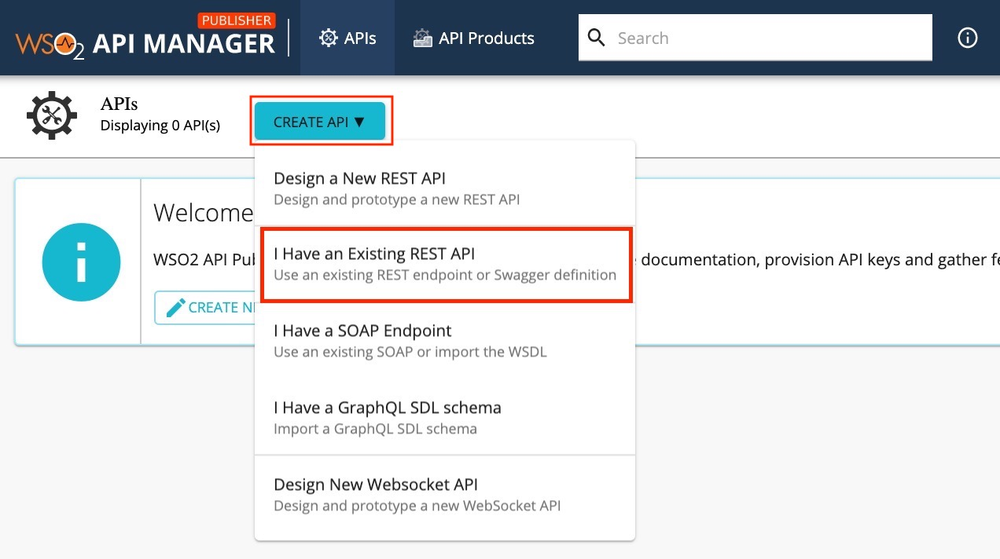
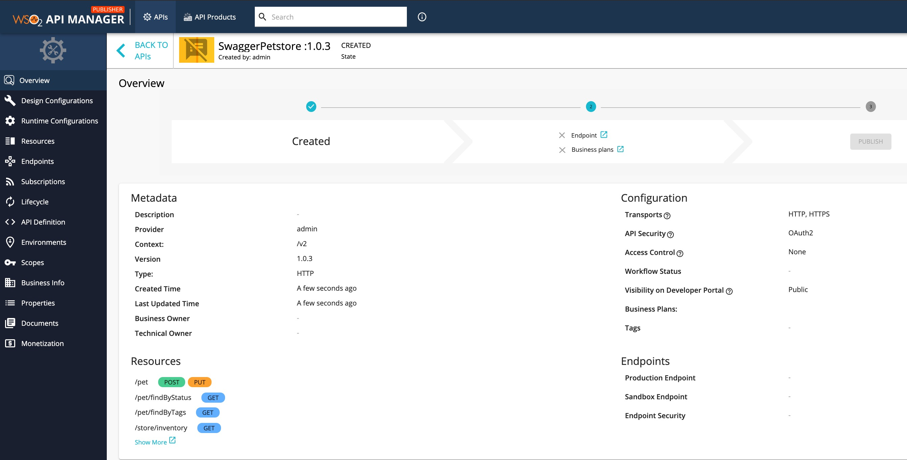
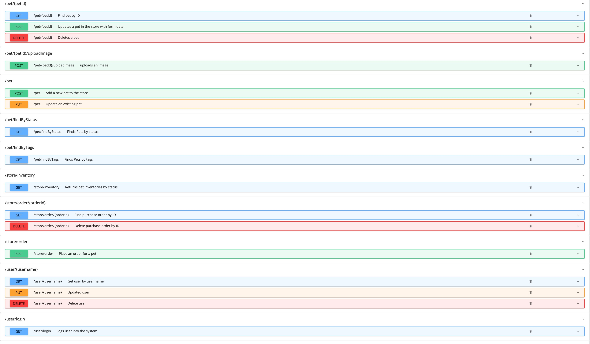
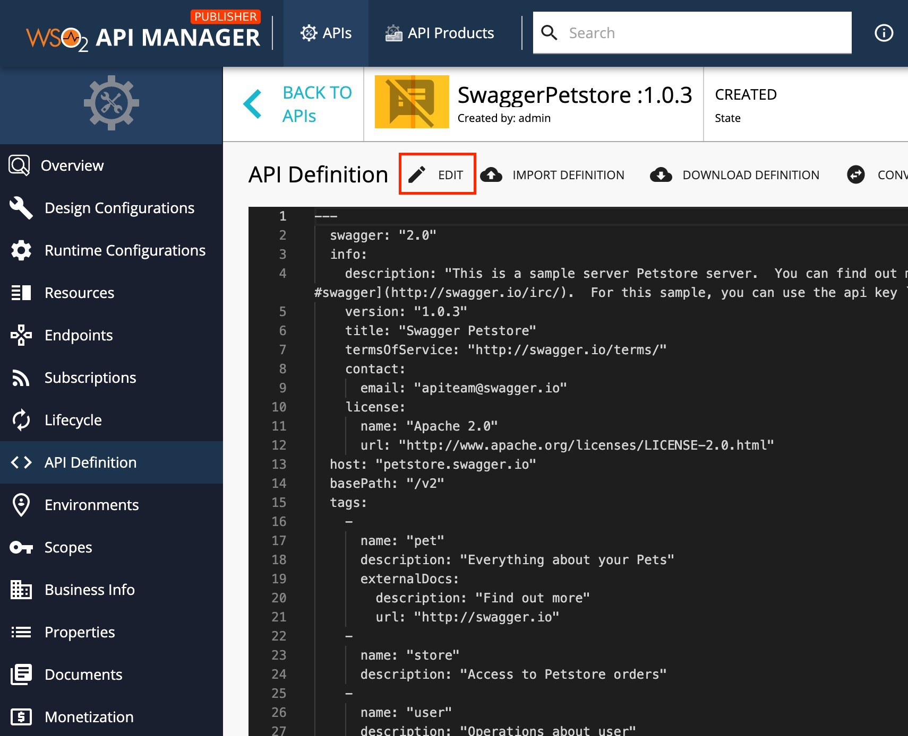
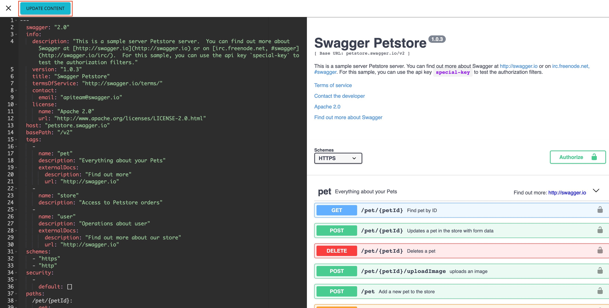
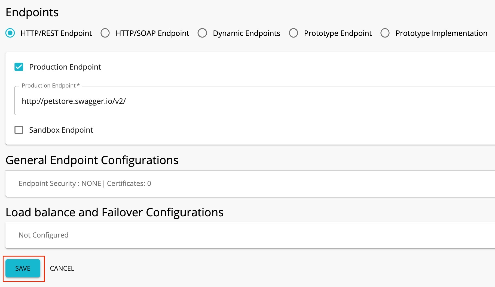
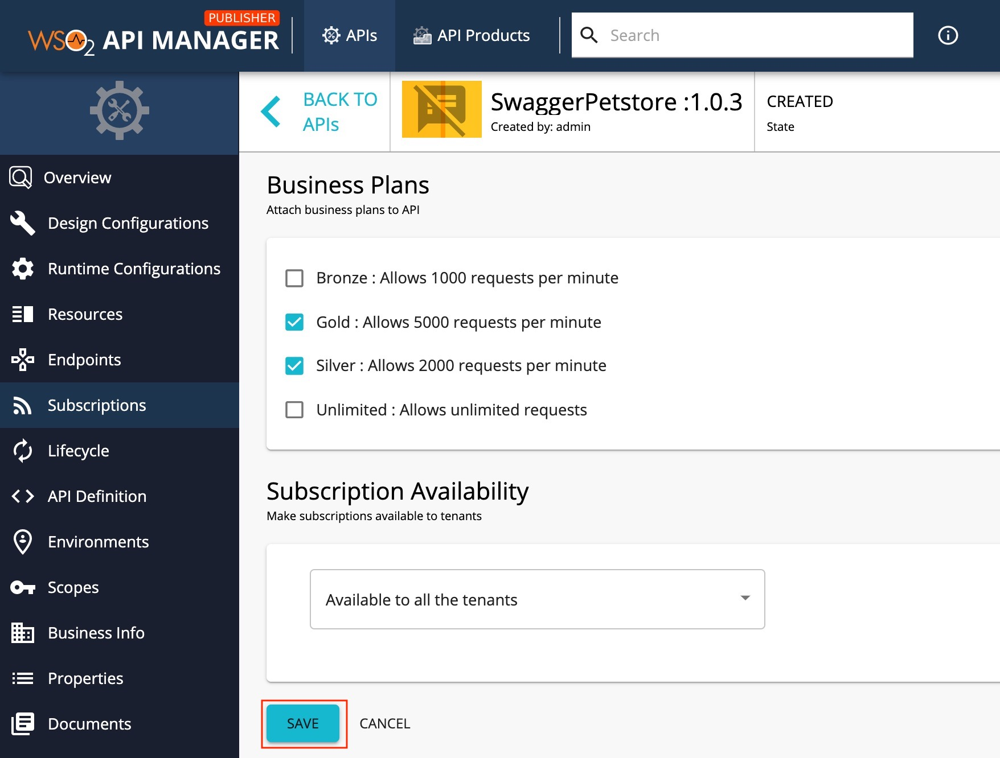

# Create an API from a Open API Definition

A Swagger definition is a format that describes REST APIs. 
Follow the instructions below to create a REST API using a Open API definition for an existing API.

## Create an API using basic flow
1. Sign in to the WSO2 API Publisher providing username and password `https://<hostname>:9443/publisher` (e.g., `https://localhost:9443/publisher` ).
    <html><div class="admonition note">
      <p class="admonition-title">Note</p>
      <p>CREATE button will only appear for user who has creator role permission.</p>
      </div>
    </html>

2.  Go to **CREATE API** and Click **I Have an Existing API**.
    

3.  Select **OpenAPI URL** and provide `http://petstore.swagger.io/v2/swagger.json` as the URL. Click **NEXT** .
    

4.  Edit the information as given below and Click **CREATE**

    | Field   | Sample value |
    |---------|--------------|
    | Name    | Petstore     |
    | Context | /petstore    |
    | Version | 1.0.0        |

    

5. Page will be redirected to the overview page of the Petstore API.
 [](../../../assets/img/Learn/overviewpage-rest-api-creating-by-swagger-Def.jpg)

## Resources
   Navigate to **Resources** tab and notice that all the **API resources** are created automatically when the Swagger URL is specified.
   
   [](../../../assets/img/Learn/resource-of-pet-store-api.jpg)

## API Definition
1. Navigate to **API Definition** and Click **Edit** to remove the security headers. This is required to invoke the API in the developer portal using the Swagger UI.
    
    


2. Remove the security tag from the `/pet` POST resource given below.

    **Swagger - Post resource**

    ``` java
        //remove the following code snippet
        security:
                - petstore_auth:
                    - 'write:pets'
                    - 'read:pets'
    ```

3.  Remove the security `pet/{petId}` GET resource given below:

    **Swagger - Get resource**

    ``` java
            //remove the following code snippet
    security:
            - api_key: []
    ```
4.  After removing the security tags, click **Update Contents** to save the changes.
 

## Enpoints
1. Navigate to the **Endpoints** page. Enter the information shown below and click **SAVE**.

    | Field               | Sample value                                          |
    |---------------------|-------------------------------------------------------|
    | Endpoint type       | HTTP/REST endpoint                                    |
    | Production endpoint | http://petstore.swagger.io/v2/                        |
    | Sandbox endpoint    | Providing only the production endpoint is sufficient. |

     <html>
     
     </html>

    

## Runtime Configuration
  Navigate to **Runtime Configuration** page. 
  Transport Level Security  defines the transport protocol on which the API is exposed.
     
  <html>
     
     </html>

  <html><div class="admonition note">
     <p class="admonition-title">Note</p>
     <p> Both HTTP and HTTPS transports are selected by default.It is able to limit the API availability to only one transport (e.g., HTTPS), clear the checkbox of the other transport.</p>
     </div>
     </html>

## Subscriptions
   Navigate to **Subscriptions** page and select **Gold** and **Silver** as the Bussiness plans. After Click **SAVE**

   <html><div class="admonition note">
     <p class="admonition-title">Note</p>
     <p> The API can be available at different levels of service. They allow you to limit the number of successful hits to an API during a given period of time.</p>
     </div>
     </html>

   


Now, a REST API from open API Definition has been created and configured successfully. Refer [Publish API](../../../../Learn/DesignAPI/PublishAPI/publish-an-ap)  to get details of publishing API.


